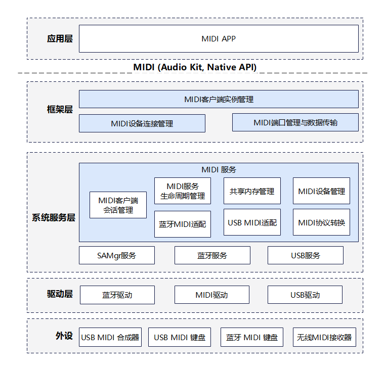
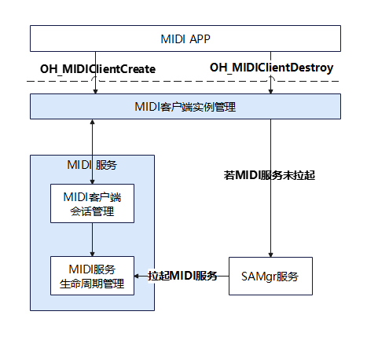
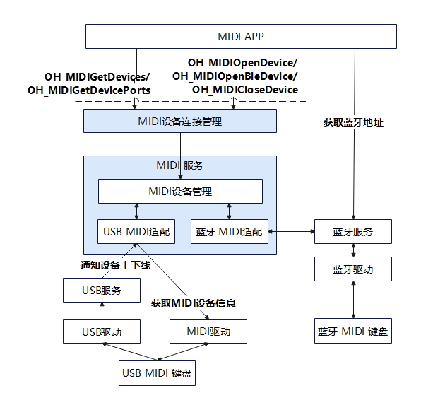
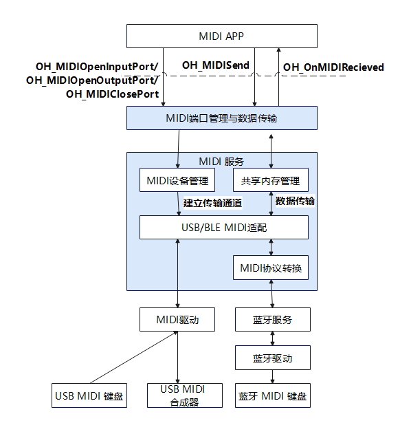

# midi_framework

## 简介
`midi_framework` 是 OpenHarmony 系统中用于管理和控制 MIDI（Musical Instrument Digital Interface）设备的模块。它提供统一的接口来管理符合 MIDI 标准的电子乐器、控制器及周边音频设备（如电子琴、电子鼓等），屏蔽底层硬件差异，使得应用能够方便地通过 Native API 与外部 MIDI 设备进行高性能交互。

midi_framework 包含以下常用功能：

* **设备发现与管理**：支持查询已连接 USB 及 BLE MIDI 设备的列表、热插拔监听及连接 BLE MIDI 设备。
* **高性能数据传输**：支持基于 UMP（Universal MIDI Packet）协议的指令收发。

midi_framework 部件是一个可选系统能力，应用需要通过 SystemCapability.Multimedia.Audio.MIDI 判断OpenHarmony设备是否支持MIDI。

## 系统架构

<div align="center">
  
  <br>
  <b>图 1</b> 服务按需启动与生命周期管理流程图
</div>

### 模块功能说明

整体架构划分为应用层、框架层（提供API）、系统服务层、驱动层及外设。

* **应用层**
  * **MIDI APP**: 终端用户应用（如 DAW、教学软件）。负责调用 MIDI 客户端接口，执行业务逻辑，如设备扫描（BLE）、设备选择及MIDI数据的处理与展示。

* **框架层**
  * **MIDI 客户端实例管理**: 负责对外提供 `OH_MIDIClientCreate/Destroy` 等接口，维护客户端上下文，并负责向系统申请或释放 MIDI 服务资源。
  * **MIDI 设备连接管理**: 负责 `OH_MIDIOpen/CloseDevice` 及 `OH_MIDIGetDevices` 等接口，处理设备的逻辑连接与状态查询。
  * **MIDI 端口管理与数据传输**: 负责 `OH_MIDIOpenInput/OutputPort` 等接口，建立应用与服务间的数据传输通道。

* **系统服务层 (Midi Server)**
  * **MIDI 服务生命周期管理**: 负责服务进程的启动与退出控制。它响应 SAMgr 的拉起请求完成初始化，并持续监控系统内的活跃会话；当无活跃客户端且超时（如15秒）后，触发资源释放与进程自动退出。
  * **MIDI 客户端会话管理**: 负责响应客户端的 IPC 请求，管理跨进程会话资源。并在无活跃会话时触发服务退出机制。
  * **MIDI 设备管理**: 维护全局已连接设备列表，统一分发设备热插拔状态（`OH_OnMidiDeviceChange`）等。
  * **共享内存管理**: 负责高性能数据通道的建立与维护。它在服务端分配共享内存区块及无锁队列（Ring Buffer），并将其映射到客户端进程，确保 MIDI 数据在跨进程传输时实现低延迟、零拷贝。
  * **USB MIDI 适配**: 对接 USB 服务与 MIDI 驱动，处理标准 USB MIDI 设备的连接与数据透传。
  * **蓝牙 MIDI 适配**: 对接蓝牙服务，处理 BLE MIDI 设备的连接维护与数据读写。
  * **MIDI 协议转换**: 负责在 UMP（通用 MIDI 包）与传统 MIDI 1.0 字节流之间进行转换（主要用于 BLE 设备）。
  * **SAMgr 服务 (System Ability Manager)**: 系统能力管理服务，负责 MIDI 服务的按需拉起。
  * **USB 服务 / 蓝牙服务**: OpenHarmony 基础系统服务。USB 服务负责上报硬件插拔事件；蓝牙服务负责 BLE 扫描与 GATT 连接。

* **驱动层**
  * **MIDI 驱动**: 实现硬件抽象，提供对底层 USB MIDI 设备节点的访问能力。
  * **USB 驱动**: 负责识别 USB 设备，与USB服务交互。
  * **蓝牙 驱动**: 负责与蓝牙服务交互，提供与BLE外设的连接、数据传输的能力。

* **外设**
  * **USB MIDI 外设**: 如 USB MIDI 键盘、合成器。
  * **BLE MIDI 外设**: 如 蓝牙 MIDI 键盘、无线MIDI接收器。

### 关键交互流程

为了更清晰地展示各模块如何协同工作，以下详解三大核心流程：

#### 服务按需启动与生命周期管理

MIDI 服务采用 **“按需启动、自动退出”** 的策略，以降低系统资源消耗。

<div align="center">
  
  <br>
  <b>图 2</b> 服务按需启动与生命周期管理流程图
</div>

1. **拉起服务**:
   * 当 **MIDI APP** 调用 `OH_MIDIClientCreate` 时，**MIDI 客户端实例管理** 模块会向 **SAMgr 服务** 查询 MIDI 服务代理。
   * 若服务未启动，**SAMgr 服务** 会自动拉起 MIDI 服务进程，并完成服务的初始化。
2. **建立会话**:
   * 服务启动后，客户端通过 IPC 与服务端的 **MIDI 客户端会话管理** 模块建立连接，分配对应的服务资源。
3. **资源回收**:
   * **主动销毁**: 当 **MIDI APP** 调用 `OH_MIDIClientDestroy` 时，服务端释放对应资源。
   * **异常监测**: 建立连接时，客户端会将回调对象（Stub）注册至服务端。服务端的 **MIDI 客户端会话管理** 模块通过 IPC 机制订阅该对象的[**死亡通知（Death Recipient）**](https://gitcode.com/openharmony/docs/blob/master/zh-cn/application-dev/ipc/subscribe-remote-state.md)，服务端感知后，立即清理该客户端占用的会话与共享内存资源。
   * **退出判定**: **MIDI 服务生命周期管理** 模块持续监控会话状态。当活跃客户端数量降为0，且在15秒内无新的连接建立时，该模块执行服务资源释放逻辑并自动退出进程。

#### 设备发现与连接管理

设备连接流程根据物理链路（USB/BLE）的不同，涉及不同的外部模块交互。

<div align="center">
  
  <br>
  <b>图 3</b> 设备发现与连接管理流程图
</div>

* **USB MIDI 设备流程**:
  1. **物理接入**: USB MIDI 键盘/合成器插入，**USB 驱动** 识别硬件并上报给 **USB 服务**。
  2. **被动发现**: **USB 服务** 通知 MIDI 服务的 **USB MIDI 适配** 模块。适配模块解析设备信息后，将其注册到 **MIDI 设备管理** 模块。
  3. **通知应用**: 若 **MIDI APP** 注册了回调，会收到设备上线事件。此时 APP 可调用 `OH_MIDIGetDevices` 获取最新列表。
  4. **建立连接**: APP 调用 `OH_MIDIOpenDevice` -> 客户端通过 IPC 请求服务端 -> 服务端 **MIDI 设备管理** 识别为 USB 设备 -> 调度 **USB MIDI 适配** 模块 -> 通过 **MIDI 驱动** 打开底层设备节点。


* **BLE MIDI 设备流程**:
  1. **主动发现**: **MIDI APP** 调用[系统蓝牙接口](https://gitcode.com/openharmony/docs/blob/master/zh-cn/application-dev/connectivity/bluetooth/ble-development-guide.md)（`@ohos.bluetooth.ble`的`startBLEScan`）启动扫描，根据 UUID 过滤出 BLE MIDI 外设。
     * **MIDI Service UUID**: `03B80E5A-EDE8-4B33-A751-6CE34EC4C700` (参照 [Bluetooth Low Energy MIDI Specification](https://midi.org/midi-over-bluetooth-low-energy-ble-midi))
  2. **接入服务**: APP 获取 MAC 地址后，调用 `OH_MIDIOpenBleDevice`。
  3. **建立连接**: 客户端请求服务端 -> 服务端 **MIDI 设备管理** 识别为 BLE 请求 -> 调度 **蓝牙 MIDI 适配** 模块 -> 调用 **蓝牙服务** 建立 GATT 连接。
  4. **统一管理**: 连接成功后，该 BLE 设备被纳入 **MIDI 设备管理** 模块的通用列表，APP 可像操作 USB 设备一样对其进行端口操作。

#### 端口管理与数据传输

数据传输链路涉及跨进程通信与协议适配。

<div align="center">
  
  <br>
  <b>图 4</b> 端口管理与数据传输流程图
</div>

1. **建立通路**:
   * **MIDI APP** 调用 `OH_MIDIOpenInputPort/OutputPort`。
   * **MIDI 端口管理** 模块与服务端协商，在客户端与服务端之间建立 **共享内存** 通道。
2. **数据收发**:
   * **发送 (APP -> 外设)**: APP 调用 `OH_MIDISend` -> 数据写入共享内存 -> 服务端读取。
   * **分发**:
   * 若为 **USB 设备**: 数据经由 **USB MIDI 适配** 模块 -> **MIDI 驱动** -> **USB 驱动** -> 外设。
   * 若为 **BLE 设备**: 数据经由 **蓝牙 MIDI 适配** 模块 -> **MIDI 协议转换** (UMP转字节流) -> **蓝牙服务** -> **蓝牙驱动** -> 外设。
3. **接收 (外设 -> APP)**:
   * 外设数据经驱动上报，服务端适配模块处理后（BLE 需进行协议转换），写入共享内存。
   * 客户端 **MIDI 端口管理** 读取数据，并通过 `OH_OnMIDIReceived` 回调通知 **MIDI APP**。

## 目录

仓目录结构如下：


```
/foundation/multimedia/midi_framework      # MIDI部件业务代码
├── bundle.json                            # 部件描述与编译配置文件
├── config.gni                             # 编译配置参数
├── figures                                # 架构图等资源文件
├── frameworks                             # 框架层实现
│   └── native
│       ├── midi                           # MIDI客户端核心逻辑 (Client Context)
│       ├── midiutils                      # 基础工具库
│       └── ohmidi                         # Native API 接口实现
├── interfaces                             # 接口定义
│   ├── inner_api                          # 内部接口
│   └── kits                               # 对外接口
├── sa_profile                             # 系统服务配置文件
├── services                               # MIDI服务层实现
│   ├── common                             # 服务端通用组件 (共享内存, UMP协议处理)
│   ├── etc                                # 进程启动配置 (midi_server.cfg)
│   ├── idl                                # IPC通信接口定义
│   └── server                             # 服务端核心逻辑 (设备管理, 驱动适配, 客户端连接管理)
└── test                                   # 测试代码
    ├── fuzzer                             # Fuzzing测试用例
    └── unittest                           # 单元测试用例

```

## 编译构建

根据不同的目标平台，使用以下命令进行编译：

**编译32位ARM系统midi_framework部件**

```bash
./build.sh --product-name {product_name} --ccache --build-target midi_framework

```

**编译64位ARM系统midi_framework部件**

```bash
./build.sh --product-name {product_name} --ccache --target-cpu arm64 --build-target midi_framework

```

> **说明：**
> `{product_name}` 为当前支持的平台名称，例如 `rk3568`。

## 使用说明

### 接口说明

midi_framework部件向开发者提供了 **Native API**，主要涵盖客户端管理、设备管理及端口操作。主要接口及其功能如下：

**表 1** 接口说明

| 接口名称                  | 功能描述                                                             |
| ------------------------- | -------------------------------------------------------------------- |
| **OH_MIDIClientCreate**   | 创建MIDI客户端实例，初始化上下文环境，并可注册设备热插拔及错误回调。 |
| **OH_MIDIClientDestroy**  | 销毁MIDI客户端实例，释放相关资源。                                   |
| **OH_MIDIGetDevices**     | 获取当前系统已连接的MIDI设备列表及设备详细信息。                     |
| **OH_MIDIGetDevicePorts** | 获取指定设备的端口信息。                                             |
| **OH_MIDIOpenDevice**     | 打开指定的MIDI设备，建立连接会话。                                   |
| **OH_MIDIOpenBleDevice**  | 打开指定的BLE MIDI设备，建立连接会话。                               |
| **OH_MIDICloseDevice**    | 关闭已打开的MIDI设备，断开连接。                                     |
| **OH_MIDIOpenInputPort**  | 打开设备的指定输入端口，准备接收MIDI数据。                           |
| **OH_MIDIOpenOutputPort** | 打开设备的指定输出端口，准备发送MIDI数据。                           |
| **OH_MIDISend**           | 向指定输出端口发送MIDI数据。                                         |
| **OH_MIDIClosePort**      | 关闭指定的输入或输出端口，停止数据传输。                             |

### 开发步骤

以下演示使用 Native API 开发 MIDI 应用的完整流程，包含客户端创建、热插拔监听、设备发现、数据收发及资源释放(简单起见，只展示已连接设备的示例代码)。

1. **创建客户端**：初始化 MIDI 客户端上下文，并注册设备热插拔回调及服务异常回调。
2. **发现设备与端口**：获取当前连接的设备列表，并查询设备的端口能力。
3. **打开设备**：建立设备连接会话。
4. **打开端口**：根据端口方向（Input/Output）分别打开端口。
5. **数据交互**：
* **接收**：通过回调函数接收 UMP 格式的 MIDI 数据。
* **发送**：构建 UMP 数据包并通过 Output 端口发送。
6. **释放资源**：使用完毕后关闭端口、设备并销毁客户端。

#### 代码示例

```cpp
#include <native_midi.h>
#include <vector>
#include <iostream>
#include <thread>
#include <chrono>
#include <iomanip>

// 1. 定义设备热插拔回调
void OnDeviceChange(void *userData, OH_MIDIDeviceChangeAction action, OH_MIDIDeviceInformation info) {
    if (action == MIDI_DEVICE_CHANGE_ACTION_CONNECTED) {
        std::cout << "[Hotplug] Device Connected: ID=" << info.midiDeviceId
                  << ", Name=" << info.productName << std::endl;
    } else if (action == MIDI_DEVICE_CHANGE_ACTION_DISCONNECTED) {
        std::cout << "[Hotplug] Device Disconnected: ID=" << info.midiDeviceId << std::endl;
    }
}

// 2. 定义服务错误回调
void OnError(void *userData, OH_MIDIStatusCode code) {
    std::cout << "[Error] Critical Service Error occurred! Code=" << code
              << ". Client may need recreation." << std::endl;
}

// 3. 定义数据接收回调
void OnMIDIReceived(void *userData, const OH_MIDIEvent *events, size_t eventCount) {
    for (size_t i = 0; i < eventCount; ++i) {
        if (events[i].data != nullptr) {
            // 使用 hex, setw, setfill 格式化 32 位十六进制输出，并在结束后用 dec 恢复十进制
            std::cout << "[Rx] Timestamp=" << events[i].timestamp
                      << ", Data=0x" << std::hex << std::setw(8) << std::setfill('0')
                      << events[i].data[0] << std::dec << std::endl;
        }
    }
}

void MIDIDemo() {
    // 1. 创建 MIDI 客户端并注册回调
    OH_MIDIClient *client = nullptr;
    OH_MIDICallbacks callbacks;
    callbacks.onDeviceChange = OnDeviceChange;
    callbacks.onError = OnError;

    OH_MIDIStatusCode ret = OH_MIDIClientCreate(&client, callbacks, nullptr);
    if (ret != MIDI_STATUS_OK) {
        std::cout << "Failed to create client." << std::endl;
        return;
    }

    // 2. 获取设备列表 (两次调用模式)
    size_t devCount = 0;
    OH_MIDIGetDevices(client, nullptr, &devCount);

    if (devCount > 0) {
        std::vector<OH_MIDIDeviceInformation> devices(devCount);
        OH_MIDIGetDevices(client, devices.data(), &devCount);

        // 示例：操作列表中的第一个设备
        int64_t targetDeviceId = devices[0].midiDeviceId;
        std::cout << "Target Device ID: " << targetDeviceId << std::endl;

        // 3. 获取端口信息 (无需 OpenDevice 即可查询)
        size_t portCount = 0;
        OH_MIDIGetDevicePorts(client, targetDeviceId, nullptr, &portCount);

        if (portCount > 0) {
            std::vector<OH_MIDIPortInformation> ports(portCount);
            OH_MIDIGetDevicePorts(client, targetDeviceId, ports.data(), &portCount);

            // 4. 打开设备
            OH_MIDIDevice *device = nullptr;
            ret = OH_MIDIOpenDevice(client, targetDeviceId, &device);

            if (ret == MIDI_STATUS_OK && device != nullptr) {
                // 5. 遍历并打开端口
                for (const auto& port : ports) {
                    // --- 场景 A: 输入端口 (接收) ---
                    if (port.direction == MIDI_PORT_DIRECTION_INPUT) {
                        OH_MIDIPortDescriptor desc = {port.portIndex, MIDI_PROTOCOL_1_0};
                        if (OH_MIDIOpenInputPort(device, desc, OnMIDIReceived, nullptr) == MIDI_STATUS_OK) {
                            std::cout << "Input port " << port.portIndex << " opened." << std::endl;
                        }
                    }
                    // --- 场景 B: 输出端口 (发送) ---
                    else if (port.direction == MIDI_PORT_DIRECTION_OUTPUT) {
                        OH_MIDIPortDescriptor desc = {port.portIndex, MIDI_PROTOCOL_1_0};
                        if (OH_MIDIOpenOutputPort(device, desc) == MIDI_STATUS_OK) {
                            std::cout << "Output port " << port.portIndex << " opened. Sending data..." << std::endl;

                            // 构建 UMP 数据包: MIDI 1.0 Note On -> Channel 0, Note 60, Vel 100
                            uint32_t umpMsg[1] = { 0x20903C64 };

                            OH_MIDIEvent event;
                            event.timestamp = 0; // 0 表示立即发送
                            event.length = 1;    // 数据长度 (1 word)
                            event.data = umpMsg; // 指向 32位 数组

                            uint32_t written = 0;
                            OH_MIDISend(device, port.portIndex, &event, 1, &written);
                        }
                    }
                }

                // 模拟业务运行，等待数据接收
                std::this_thread::sleep_for(std::chrono::seconds(2));

                // 6. 资源释放：关闭端口
                for (const auto& port : ports) {
                    OH_MIDIClosePort(device, port.portIndex);
                }
                OH_MIDICloseDevice(device);
            }
        }
    }

    // 7. 销毁客户端
    OH_MIDIClientDestroy(client);
    client = nullptr;
}

```

#### 注意事项

* **数据格式**：`OH_MIDIEvent` 中的 `data` 指针类型为 `uint32_t*`。在处理 MIDI 2.0 (UMP) 数据时，每个 UMP 数据包由 1 至 4 个 32 位字组成。
* **内存获取模式**：`OH_MIDIGetDevices` 和 `OH_MIDIGetDevicePorts` 均采用“两次调用”模式。第一次传入 `nullptr` 获取数量，第二次传入分配好的缓冲区获取实际数据。
* **非阻塞发送**：`OH_MIDISend` 为非阻塞接口。如果底层缓冲区已满，该接口可能只发送部分数据，请务必检查 `eventsWritten` 返回值。
* **回调限制**：`OnMIDIReceived` 和 `OnDeviceChange` 回调函数运行在非 UI 线程，请勿直接在回调中执行耗时操作或操作 UI 控件。

## 约束

* **硬件与内核要求**
  * **USB MIDI**：OpenHarmony 开发设备必须支持 **USB Host 主机模式**。
    * **ALSA 依赖**：当前 MIDI HDI 驱动依赖 `alsa-libs` 实现，未开启 ALSA 内核选项的开发设备将无法使用 USB MIDI 相关能力。
    * **RK3568 适配注意事项**（以 RK3568 为例）：
      * **内核配置**：默认配置通常 **未开启 ALSA**。需参考 [alsa-libs 使用指南](https://gitcode.com/openharmony/third_party_alsa-lib#5-如何使用) 修改内核配置文件（`arch/arm64_defconfig`），**开启 ALSA 支持** 并重新编译烧录内核。此外，为支持 USB MIDI 功能，**必须开启** `CONFIG_SND_USB_AUDIO`（USB 驱动）及 `CONFIG_SND_RAWMIDI`（MIDI 核心），建议同时开启 `CONFIG_SND_SEQUENCER`。
      * **系统构建连带影响**：
        * 开启 ALSA 内核选项后，系统 Audio HDF 驱动会切换至 ALSA 实现模式。受限于最新的部件独立构建编译规范，Audio HDF 可能会因无法引用板级（Board）目录下的代码而导致**内核编译失败**。
        * **注意**：此修改与 MIDI 业务无关，仅为了**保证系统内核及镜像能顺利编译通过**。若遇到 Audio HDF 报错，可将缺少的相关依赖代码（位于 `device/board/...`）手动拷贝至驱动目录以临时规避。
      * **组件配置**：需在 `vendor/hihope/rk3568/config.json` 中确保 `midi_framework`、`drivers_peripheral_midi`、`drivers_interface_midi` 等部件已加入编译。
      * **权限配置**：需检查 `/system/etc/ueventd.config`，确保 `midi_server` 对 `/dev/snd/controlC*` 及 `/dev/snd/midiC*D*` 拥有访问权限（通常需配置为 `0660 system audio`），否则会导致**设备列表为空**。
  * **BLE MIDI**：OpenHarmony 开发设备必须支持 BLE（Bluetooth Low Energy）协议。

* **驱动开发状态**
  * 当前版本的 **MIDI HAL** 主要对接标准 ALSA 接口以支持 USB 设备，代码位于 [drivers_peripheral](https://gitcode.com/openharmony/drivers_peripheral)。
  * MIDI HDI 驱动接口尚在标准化过程中。

* **协议与数据格式**
  * `midi_framework` 采用全链路 **UMP (Universal MIDI Packet) Native** 设计。无论物理设备是 MIDI 1.0 还是 MIDI 2.0，Native API 接口收发的数据**始终为 UMP 格式**。

* **权限说明**
  * 应用访问 BLE MIDI 设备需要申请相应的系统权限 (`@ohos.permission.ACCESS_BLUETOOTH`)。

## 相关仓
[媒体子系统](https://gitcode.com/openharmony/docs/blob/master/zh-cn/readme/媒体子系统.md)<br>
[drivers_interface](https://gitcode.com/openharmony/drivers_interface)<br>
[drivers_peripheral](https://gitcode.com/openharmony/drivers_peripheral)<br>
[alsa-libs](https://gitcode.com/openharmony/third_party_alsa-lib)<br>
**[midi_framework](https://gitcode.com/openharmony/midi_framework-sig)**